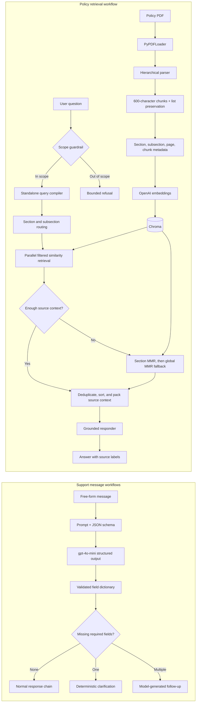

<div align="center">

# 🧠 LLM and Agentic AI Practicals

**Three explainable LangChain workflows for structured extraction, conditional routing, and policy-grounded retrieval.**


</div>

## 🎯 Product Promise

Turn unstructured language into predictable application behavior. These workflows show how an LLM can extract typed fields, route incomplete support requests, and answer policy questions from retrieved source context instead of relying on unsupported memory.

## 🔎 Problem

Useful LLM systems need more than a prompt. Inputs may be incomplete, output shapes must remain stable, retrieval can be too narrow or noisy, and generated answers need clear source boundaries. The implementations in this repository make those decisions visible through schemas, runnable branches, metadata filters, fallback retrieval, and source-labelled context.

## ✨ Capabilities: Three Practical Workflows

| Workflow | Input | Implemented behavior | Exposed result |
|---|---|---|---|
| Structured extraction | Free-form support message | `ChatPromptTemplate` and JSON-mode structured output map seven fields into a fixed schema | `extraction_chain` runnable |
| Support ticket routing | Extracted support fields | Validation counts missing required values, then branches to deterministic clarification, model-generated follow-up, or normal response | `full_chain` runnable |
| Policy RAG | Attendance policy PDF and a question | Hierarchical parsing, metadata-aware indexing, scope checks, query compilation, routed retrieval, source-context packing, and grounded response generation | Notebook assistant with streaming and debug state |

### Structured fields

`user_name`, `product_name`, `model_name`, `serial_number`, `issue`, `issue_description`, and `inquiry`

## 🗺️ Verified Architecture

The diagram is derived from the committed Python modules and notebook. It illustrates control flow only and does not represent fabricated model output.



## 🔬 Workflow Details

### 1. Structured extraction

- Uses `ChatOpenAI` with temperature `0`.
- Requests JSON-mode structured output against a seven-field schema.
- Represents missing values as empty strings for predictable downstream checks.
- Composes the prompt, model, and schema through LangChain Expression Language.

### 2. Ticket routing

- Checks five required routing fields after extraction.
- Produces a direct clarification when exactly one field is absent.
- Routes multiple missing fields to a concise follow-up chain.
- Sends complete cases to a separate support-response chain through `RunnableBranch`.

### 3. Policy RAG

- Loads the included PDF with `PyPDFLoader`.
- Parses numbered sections and subsections in one pass and removes document noise.
- Splits text at 600 characters with 100-character overlap, then repairs split enumerated lists.
- Indexes `text-embedding-3-small` vectors in Chroma with section, subsection, page, and chunk metadata.
- Applies a scope guardrail, conversation-aware query compilation, and two-stage metadata routing.
- Retrieves subsection context in parallel, widening to section and global MMR fallbacks when needed.
- Deduplicates and orders chunks before packing provenance labels for grounded generation.
- Exposes a debug snapshot and a notebook widget interface for inspecting the workflow.

## 🛠️ Technology

| Area | Technology |
|---|---|
| LLM orchestration | LangChain, LCEL runnables, prompts, branches, and parsers |
| Models | OpenAI `gpt-4o-mini` and `text-embedding-3-small` |
| Retrieval | Chroma, similarity search, MMR fallback, and metadata filters |
| Document processing | PyPDF, custom hierarchical parsing, recursive text splitting |
| Interface | Jupyter Notebook and `ipywidgets` |
| Language | Python 3.10+ |

## 🚀 Setup and Run

1. Create and activate a virtual environment:

   ```bash
   python -m venv .venv
   ```

   ```powershell
   .\.venv\Scripts\Activate.ps1
   ```

   ```bash
   source .venv/bin/activate
   ```

2. Install dependencies:

   ```bash
   python -m pip install -r requirements.txt
   ```

3. Set an OpenAI API key only when you are ready to execute model or embedding calls:

   ```powershell
   $env:OPENAI_API_KEY = "your-key"
   ```

   ```bash
   export OPENAI_API_KEY="your-key"
   ```

4. Start Jupyter and open the policy assistant notebook:

   ```bash
   python -m jupyter notebook
   ```

The standalone modules export `extraction_chain` and `full_chain` for integration into another Python process. Importing them initializes `ChatOpenAI`, so configure the environment before invocation.

## ✅ Validation and Boundaries

- The two Python modules were inspected for schema, validation, and branch behavior; the notebook contains 19 code cells and no committed execution outputs.
- Architecture claims are tied to committed code and do not depend on a generated example response.
- Model and embedding execution requires a valid OpenAI API key, network access, and available service quota.
- The policy assistant is bounded to the included source document and explicitly rejects out-of-scope questions.
- Chroma data is generated at runtime and is not committed.
- The workflows are reference implementations, not a hosted API or production support service.

## 📄 License

Released under the [MIT License](LICENSE).
